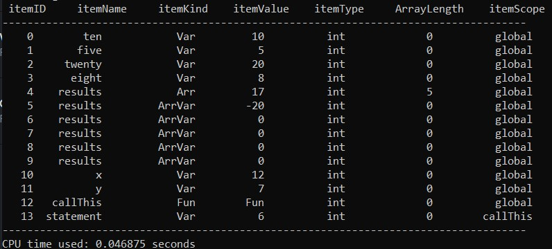

# README - C- Compiler

## Overview
This compiler processes a subset of C-like code with support for basic arithmetic, logical operations, variable declarations, arrays, and control flow statements (`if`, `else`). It compiles code into a sequence of intermediate steps, performing syntax analysis, lexical analysis, and symbol table management. The final result is runnable MIPS assembly code.

## Example C- Code
```c
// Variable declarations
int ten = 10;
int five = 5;
int twenty = 20;
int eight = 8;

int results[5];
results[1] = -20;


// First condition: Check if a complex arithmetic operation evaluates to true
if (ten * five + twenty - eight / 2 == 66) {
    writeln();
    write(1);

    // Second condition: Check logical and comparison operations in sequence
    if (ten >= five * 2 && five + twenty != eight * 2) {
        writeln();
        write(2);

        // Third condition: Nested arithmetic and comparison operations
        results[0] = (ten + five * (twenty - eight)) / 4;

        if (results[0] > 15 && results[0] <= 20) {
            writeln();
            write(3);
            // Fourth condition: Check if the result is in-between both a and c
            if (results[0] >= ten && results[0] <= twenty) {
                writeln();
                write(4);
            }
        }
    }
}

// Additional independent check using a different set of variables
int x = 12;
int y = 7;

if (x - y * 3 + 4 == 5 && x / y == 1) {
    writeln();
    write(5);
}

// Call this function at the end
fun int callThis() {
    int statement;
    statement = 6;
    writeln();
    write(statement);
    return statement;
}

// Call final function
callThis(/*No parameters for this function*/);
```

## Output
```
1
2
3
4
6
```



## Features

- **Variable Declarations**: Supports variable declaration for basic types such as `int`, `char`, `bool`, and `float`. Arrays are also supported.
- **Control Flow**: Supports conditional execution using `if` and `else`, with compound conditions combining logical (`&&`, `||`, `!`) and comparison operators (`<`, `>`, `<=`, `>=`, `==`, `!=`).
- **Arithmetic**: Basic arithmetic operations (`+`, `-`, `*`, `/`) with order of operations are supported.
- **Write Functions**: The `write()` and `writeln()` functions are used to output values to the console.
- **Symbol Table**: Maintains a symbol table for tracking declared variables and functions, ensuring that types and values are validated correctly. Includes support for scoping (global and function-level).
- **Boolean Validation**: Ensures that `bool` variables are assigned only valid values ("1" or "0").

## Symbol Table Structure

The symbol table maintains the following attributes for each symbol:
- **itemID**: A unique identifier for each symbol.
- **itemName**: The name of the variable or function.
- **itemKind**: Specifies whether the symbol is a variable or function.
- **itemType**: The data type of the symbol (`int`, `float`, `bool`, etc.).
- **itemValue**: The value assigned to the symbol (for variables).
- **arrayLength**: Length of arrays.
- **scope**: The scope in which the symbol is defined (either `global` or the name of a function).

The table also supports function-specific symbols, tracking variables used within each function.

## How It Works

1. **Lexical Analysis**: The lexer processes the code, recognizing keywords (`int`, `write`, `if`, etc.), operators, identifiers, numbers, and punctuation.
2. **Parsing**: The parser checks for syntactical correctness by converting the lexer's output into a structured format.
3. **Symbol Table Management**: The symbol table stores variable and function definitions, ensuring correct usage and type consistency across the code.
4. **Code Generation**: The output of the compiler is an intermediate representation of the code, which includes the parsed operations and a sequence of `write` or `writeln` instructions.

## Future Enhancements

- **Error Handling**: Improve error messages to provide better feedback to users, especially for type mismatches or undefined variables.
- **Optimization**: Implement optimization strategies for efficient code generation.

## License

This compiler is open-source, and you are free to modify and distribute it under the terms of the MIT License.
